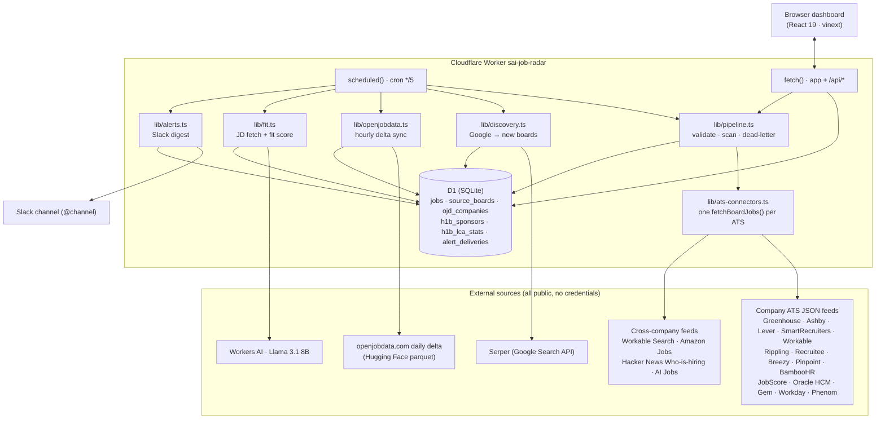
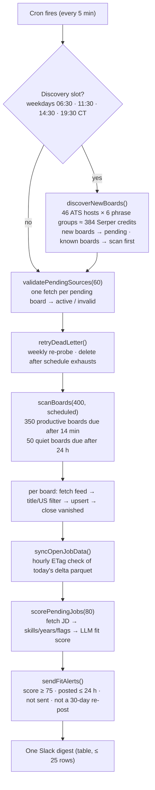

# Job Radar — Technical Design & Architecture

**Version:** 3.0 · **Status:** Live on Cloudflare Workers (Workers Paid) · **Date:** September 2026

---

## 1. Purpose

A single-user job-discovery dashboard for US data / AI / analytics engineering roles, tuned for one outcome:
apply within the first hour a role is posted, at companies that sponsor H-1B visas. It reads employers'
applicant-tracking systems (ATS) directly, scores every posting against the owner's profile with a small LLM,
and pushes qualifying roles to Slack. The catalog covers ~19,700 live company boards across 19 connectors.

## 2. Design principles

1. **Go to the source.** Companies publish roles on their ATS the moment a recruiter hits publish. Read those
   public JSON feeds directly; never scrape HTML, never use an aggregator as the system of record.
2. **Quantity and quality.** Seed every US company on a readable ATS (openjobdata.com registry, owner's application
   history, YC, S&P 500, Google discovery), then let a strict title/location/clearance filter and the fit score
   decide what surfaces.
3. **Nothing to babysit.** A 5-minute cron scans, scores and alerts. The dashboard is optional.
4. **Fresh means posted, not found.** Every job carries the ATS's own posting date where the ATS exposes one;
   alerts require a real posting date within 24 hours.
5. **No secrets in code.** Serper and Slack credentials are Workers Secrets only.

## 3. High-level architecture



### Components

| Component | Technology | Role |
|---|---|---|
| Web app + API | vinext (Next.js-compatible on Vite), React 19, TypeScript | Dashboard UI and `/api/*` route handlers |
| Runtime | Cloudflare Workers, `nodejs_compat` (`worker/index.ts`) | Serves the app; exports `scheduled()` |
| Scheduler | Workers Cron Trigger `*/5 * * * *` | 288 maintenance runs a day |
| Database | Cloudflare D1 (SQLite) via drizzle-orm | Jobs, boards, registries, run logs, key/value state |
| LLM | Workers AI (`@cf/meta/llama-3.1-8b-instruct`) | Fit score 0–100 per job |
| Secrets | Workers Secrets | `SERPER_API_KEY`, `SLACK_WEBHOOK_URL`, optional `SLACK_MENTION`, `NTFY_TOPIC` |
| Search | Serper.dev | Discovery of boards Google indexed in the last 24 h |
| Company registry | openjobdata.com public dataset (109k companies, detected ATS) | Seeding + mapping delta rows to boards |
| Build / deploy | `npx vinext build` → `npx wrangler deploy --config dist/server/wrangler.json` | One command from a laptop |

## 4. Data flow

### 4.1 The 5-minute cycle (`lib/scheduled.ts`)



**Board selection.** A board is *productive* when its last scan found at least one matching title; it is re-scanned
14 minutes after its last scan. All other boards are *quiet* and due daily. Because productive boards always have
some due, 50 of the 400 slots are reserved for quiet boards so a company posting its first data role is caught
within a day even when the dashboard is closed.

**Time to Slack.** A new posting on a productive board reaches Slack in the first run that scans that board:
5–50 minutes. A first-ever data role on a quiet board: up to 24 hours. With the dashboard open, its own live
scan loop covers the whole catalog faster.

### 4.2 Manual full scan (dashboard "Scan now")

```
Google discovery → stage catalog seeds (POST /api/sources) → validate pending (60/call until remaining = 0)
→ scan (POST /api/internal/ingest {limit, since} until remaining = 0)
```
`since` is chosen by the server on the first call and echoed back, so the loop is finite regardless of clock skew.

### 4.3 Per-board scan (`lib/pipeline.ts › upsertBoardJobs`)

1. `fetchBoardJobs(board)` — the connector fetches the board's public JSON, maps each posting to a `CanonicalJob`,
   keeps it only if `isTargetTitle(title) && isUsLocation(location)`.
2. Aggregator connectors (Workable Search, HN, AI Jobs) key rows exactly like the direct connector would, so the
   same posting seen from two places is one row; boards they reveal are queued as pending (`queueDiscoveredBoards`).
3. `INSERT … ON CONFLICT(canonical_key) DO UPDATE` in chunks of 6 rows (D1's 100-bind-parameter limit); salary and
   the earliest known `posted_at` are preserved; a `Closed` job that reappears becomes `New`.
4. Jobs from this board not seen in this scan and still `New`/`Saved` → `Closed`.
5. Board bookkeeping: `last_scanned_at`, `last_job_count`, failure counter. Three consecutive failures move the
   board to the dead-letter queue.

### 4.4 Dead-letter queue (`lib/dead-letter.ts`)

404 → one re-check a week later, then delete. Blocked / transient / parse errors → weekly re-probe up to 8 times,
then delete. Recovered boards return to `active`. The dashboard chip shows queue · recovered · removed counts.

### 4.5 Scoring (`lib/fit.ts`)

For each unscored job (80 per run): fetch the job description where the ATS has a per-job endpoint (Greenhouse
with pay ranges and `first_published`, Workable, SmartRecruiters, BambooHR, Workday `startDate` + description);
extract skills, years and flags (`lib/jd.ts`); jobs flagged clearance / citizenship are hidden (`lib/visibility.ts`).
Five capped sub-scores are summed server-side from the LLM's structured answer against the profile stored in
`system_state.candidate_profile`. Sponsorship is checked against `h1b_sponsors` (USCIS hub) and `h1b_lca_stats`
(DOL LCA disclosures, per employer-year with data-role counts and wage quartiles).

### 4.6 Alerts (`lib/alerts.ts`)

Candidates: status `New`, `fit_score ≥ 75`, scored in the last 48 h, **posted in the last 24 h** (or first seen in
the last 24 h when the ATS publishes no date), visible. Excluded: already delivered; same company + normalized
title alerted in the last 30 days (recorded as `duplicate`). Sorted sponsors first, then score. One Slack message
per run using a native `table` block (Score · Title as link · Company · Location · Posted · H-1B), prefixed by
`<!channel>` (override with `SLACK_MENTION`). ntfy.sh is a fallback channel. `POST /api/internal/alerts {preview:n}`
sends a sample without recording deliveries.

### 4.7 openjobdata delta (`lib/openjobdata.ts`)

Hourly, with an ETag check so the ~5 MB parquet is read once a day (published 02:00–09:00 CT). Rows on readable
ATSs queue their board (origin `openjobdata-delta`); rows on unreadable ATSs (iCIMS, ADP, UKG, Paycom, Paylocity,
JazzHR, Dayforce, …) become jobs `"<ATS> (openjobdata)"` with country-level location; `closed` events are applied.
Workday rows are dropped (`INCLUDE_WORKDAY = false`).

### 4.8 Read path

`GET /api/jobs` → recent jobs. The page filters client-side: 24-hour window, run filter (All / Previous run /
New this run, default New), role family, status, source, workplace, text search; collapses duplicate
company + title + location rows keeping the newest; reloads every 5 minutes.

## 5. Data model (D1 / drizzle — `db/schema.ts`)

| Table | Purpose | Key columns |
|---|---|---|
| `jobs` | One row per posting | `id` = `<ats>:<slug>:<external_id>`, title, company, location, workplace, source, apply_url, salary, posted_at, discovered_at, last_seen_at, status, fit_score, fit_reason, fit_scored_at, jd_skills, jd_years, jd_flags |
| `source_boards` | One row per company board | `id` = `<ats>:<slug>`, ats, slug, company_name, board_url, origin, status (pending / active / invalid / error), active, last_scanned_at, last_job_count, consecutive_failures, dead-letter fields |
| `ojd_companies` | openjobdata registry | id, name, ats, slug, career_url, country (109k rows) |
| `h1b_sponsors`, `h1b_lca_stats` | Sponsorship evidence | employer name keys; LCA counts, data-role counts, wage quartiles per fiscal year |
| `alert_deliveries` | Alert dedupe | job_id, channel, delivery_status (sent / failed / backfill / duplicate), sent_at |
| `ingestion_runs`, `discovery_runs` | Run logs | counts per scan / discovery pass |
| `system_state` | Key/value | seed_catalog_offset, last_discovery_at, ojd_last_sync_at, ojd_etag_<day>, candidate_profile, dlq_removed_total, … |

## 6. Connectors and sources

| Connector | Endpoint (public JSON) | Notes |
|---|---|---|
| Greenhouse | `boards-api.greenhouse.io/v1/boards/{slug}/jobs`; per-job `?pay_transparency=true` | pay ranges + `first_published` |
| Ashby | `api.ashbyhq.com/posting-api/job-board/{slug}` | descriptions in payload |
| Lever | `api.lever.co/v0/postings/{slug}?mode=json` | |
| SmartRecruiters | `api.smartrecruiters.com/v1/companies/{slug}/postings` | |
| Workable | `apply.workable.com/api/v1/widget/accounts/{slug}` | |
| Rippling · Recruitee · Breezy · Pinpoint · BambooHR · JobScore | per-ATS public list endpoints | Rippling/Gem have no posting date |
| Oracle HCM | `{host}/hcmRestApi/resources/latest/recruitingCEJobRequisitions` | slug `host--site` |
| Gem | `POST jobs.gem.com/api/public/graphql` (JobBoardList) | |
| **Workday** | `POST {tenant}.wd{N}.myworkdayjobs.com/wday/cxs/{tenant}/{site}/jobs`; per-job `…/job/{path}` | slug `tenant.wdN--site`; US facet detected per tenant; 4 searches × ≤5 pages; only hand-picked consulting tenants (seed 16), never auto-discovered |
| **Phenom** | `POST {host}/widgets` (ddoKey `refineSearch`) | slug `host[--lang/path]`; BCG only for now |
| Workable Search | `jobs.workable.com/api/v1/jobs?query&location=United States&day_range=2` | cross-company; resolves account slugs |
| Amazon | `amazon.jobs/en/search.json?country=USA&sort=recent` | |
| Hacker News | Algolia `search_by_date` for the monthly Who-is-hiring thread | queues boards it links to |
| AI Jobs | artificialintelligencejobs.co JSON | queues unknown boards |
| openjobdata | `huggingface.co/buckets/Invicto69/Jobs-Dataset-bucket/resolve/data/minimal/changes/{day}.parquet` | hyparquet in the Worker |

Evaluated and rejected (no public JSON or bot walls): Greenhouse candidate search, Remotive, RemoteOK, Himalayas,
Gusto, Comeet, Dover, JazzHR, Jobvite, Paylocity, Dayforce, SuccessFactors sites (EY, Wipro, HCL, NTT Data),
Cloudflare-walled career sites (Cognizant, EPAM, CDW), ntfy.sh as the primary alert channel.

Exclusions (`lib/exclusions.ts`): federal contractors, EWOR, Jobgether, Momentum Engineering; Workday is not
discovered from Google and openjobdata Workday rows are dropped. Staffing agencies and India-based IT services
firms were deliberately left out of the consulting seed (owner's call, September 2026).

## 7. Catalog seeds (`data/source-seeds-N.json`, `lib/source-catalog.ts`)

1–5 original catalog · 6 S&P 500 · 7 owner's application trackers · 8 SimplifyJobs · 9 Y Combinator · 10 AI Jobs ·
11 SmartRecruiters lists · 12–13 owner's saved application links (incl. Gem) · 14 openjobdata US companies with
data-role history · 15 remaining openjobdata US companies on readable ATSs · 16 consulting/advisory firms on Workday
+ BCG on Phenom. Staged 8 rows per statement via `POST /api/sources` (never pass `offset` on prod: it rewrites the
catalog pointer).

## 8. Scheduling, throughput and cost

| Activity | Cadence | Volume | Cost |
|---|---|---|---|
| Cron | every 5 min | 288 runs/day, 400 boards each | Workers Paid $5/mo (30 s CPU/request) |
| Productive boards (~3,600) | every ~50 min | | sub-requests, free |
| Quiet boards (~16,000) | daily via 50 reserved slots | | |
| Google discovery | 4 weekday slots | ≈ 384 credits/run ≈ 1,500/day | 48k Serper credits ≈ 25–30 days |
| openjobdata delta | hourly ETag check, one 5 MB read/day | ~85 fresh US roles/day from unreadable ATSs | free |
| Scoring | 80 jobs/run (960/hour) | Workers AI | included allowance |
| Slack | one digest per run when anything qualifies | ≤ 25 rows | free webhook |

## 9. Reliability & safety

- **D1 limits**: ≤ 100 bound parameters per statement (job rows in chunks of 6, board rows in chunks of 8, key
  lookups in chunks of 90); writes batched per board.
- **Finite loops**: server-issued `since` cursor; validation and scan stop at `remaining = 0`; the remaining
  count is informational (`-1` = unknown) and never fails a scan.
- **Failure isolation**: per-board try/catch; dead-letter queue with deletion; one bad board never blocks others.
- **Rate limits**: Serper 3 concurrent with backoff on 429/5xx; Workday/Phenom capped at ~20 requests per board.
- **Idempotency**: all inserts are upserts on canonical ids; alert deliveries are recorded before dedupe.
- **Secrets**: Workers Secrets only; `.env` is git-ignored.
- **No self-fetch**: the cron calls library functions directly.

## 10. Deployment

```
npx vinext build
npx wrangler deploy --config dist/server/wrangler.json
npx wrangler d1 execute sai-job-radar --remote --file drizzle/NNNN.sql -y   # new migrations
npx wrangler secret put SLACK_WEBHOOK_URL                                     # secrets
```
`wrangler tail` does not attach from the owner's machine; debug via the JSON returned by the internal routes.

## 11. Known limitations / future work

- Workday and Phenom rows on global sites carry "United States" as the location when the tenant hides the city
  in the list payload; the per-job endpoint has the exact location and could backfill it.
- Rippling and Gem publish no posting date; their freshness is when the radar first saw the job.
- Role/location matching is regex-based; verified against the owner's 195-title list on every change.
- Pending decisions: reading Workday broadly (openjobdata would add ~75 US roles/day); staffing agencies and
  India-based IT services firms; Gmail-based application tracking; a daily "apply now" shortlist at a fixed time.
